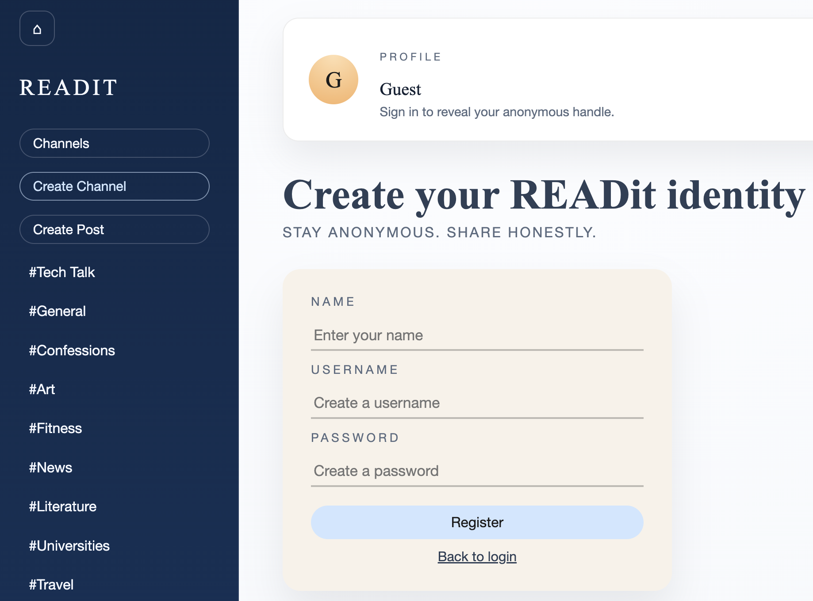
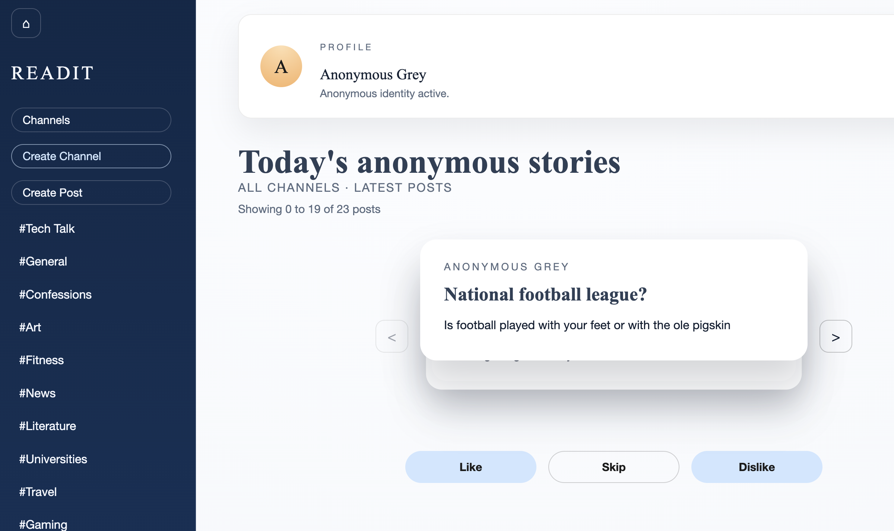
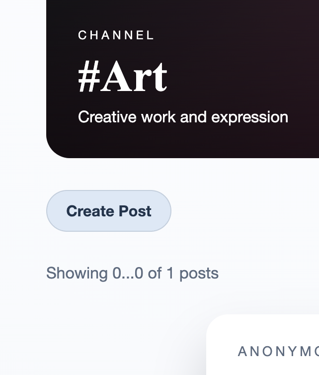
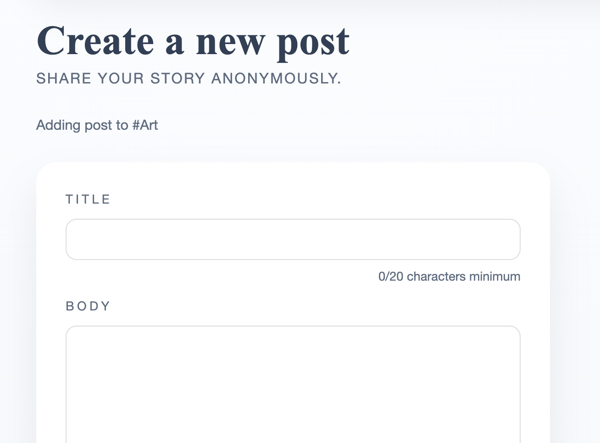
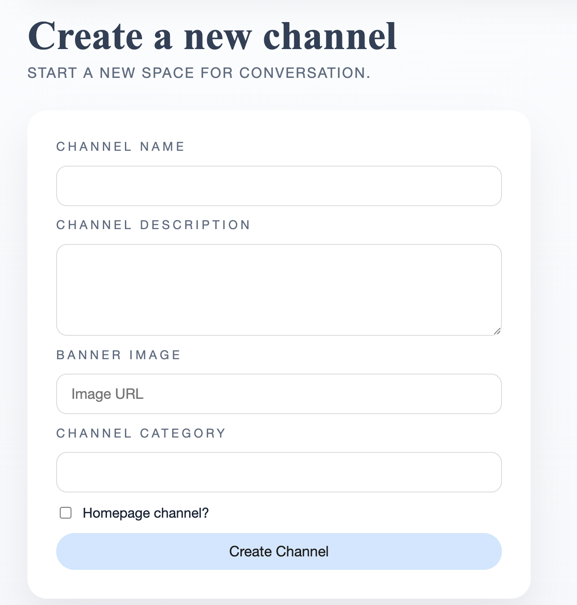
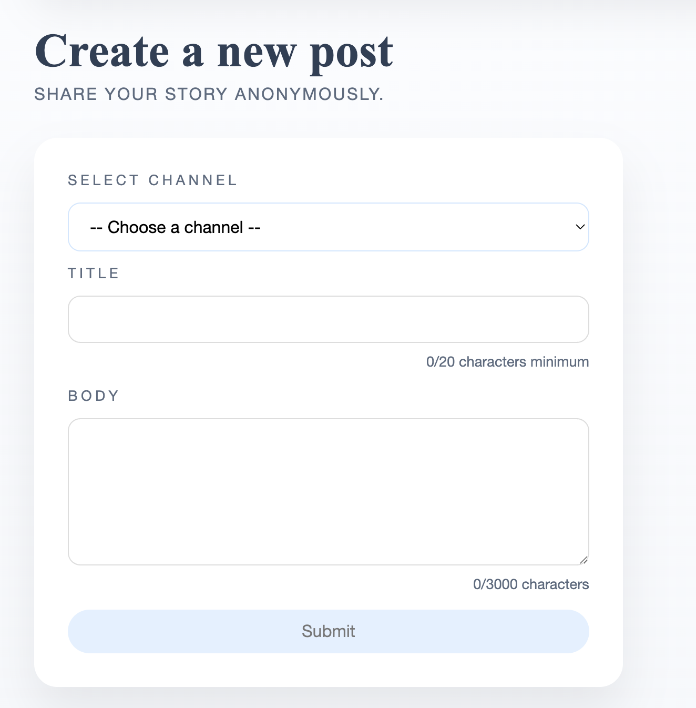
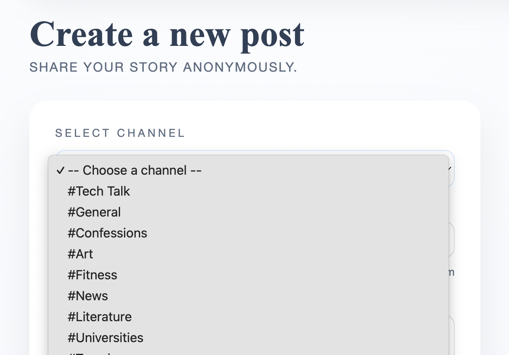
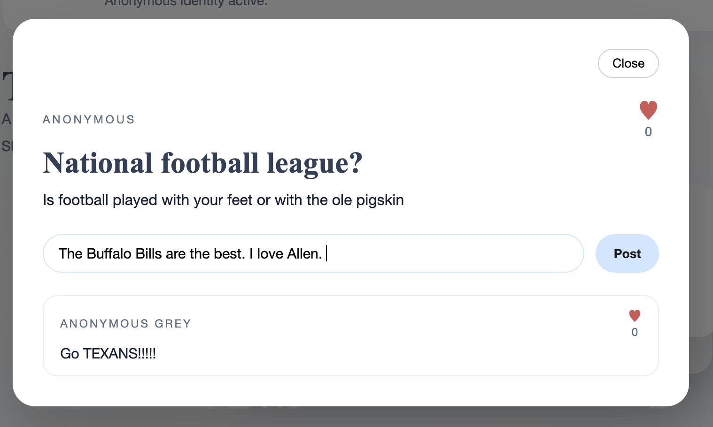
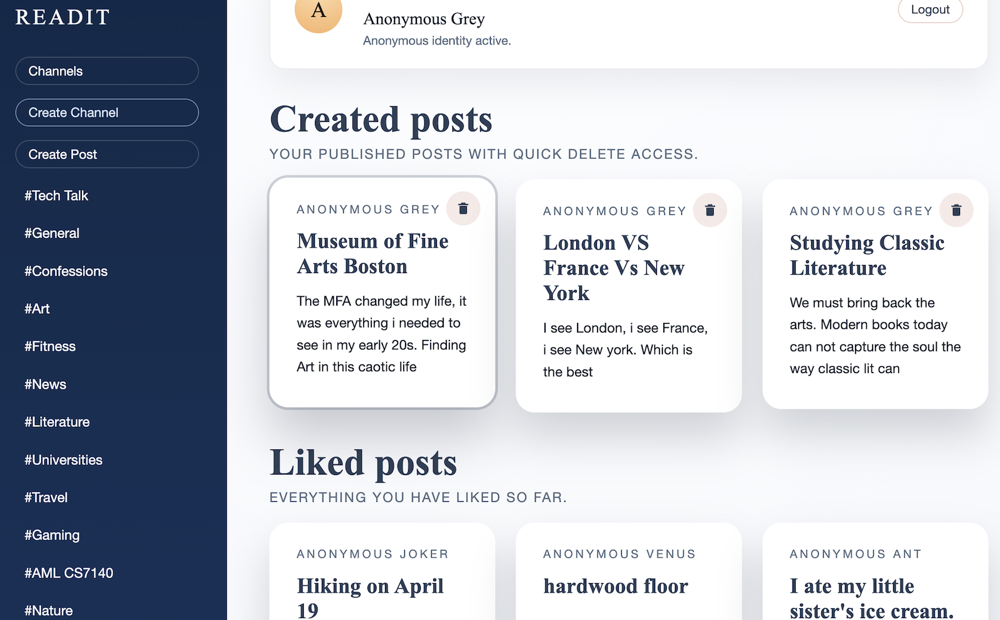

# Project :READit: ANON discussion platform

## Author

Kunj Joshi & Nina Jordan

## Class

CS 5600 – Web Design - Northeastern University
https://johnguerra.co/classes/webDevelopment_online_spring_2026/

---

## Project Objective

READit is a full-stack web application designed to allow anonymous, community discussion through channel grouped or random content. The platform enables users to discover, post, and contribute to conversations in an intuitive and immersive way.
Users browse posts by choosing dislike or like. Any user can contribute to posts through commenting sharing their options and saving the post to their profile to revisit
The application is built with a React front end hooks and component-based architecture, paired with a scalable Node.js and Express backend. MongoDB Atlas .

## Features

Channel-Based Content Discovery:

- With in channels grouped by topic , Create and browses posts to explore content.
- Navigate between homepage, profile page were your likes are visable and content channels

User interaction:

- Hit "dislike" button to skip a post
- Hit "like" to save a post to your profile for later viewing
- Comment on posts to participate in ongoing discussions, click on post to view yours and other comments
- create a post under a certian channel topic

Architecture:

- Modal-based post viewing and commenting
- Immediate UI feedback for actions like likes and interactions
- React using hooks (useState, useEffect, custom hooks)
- RESTful API built with Node.js and Express
- controller, route, and service
- MongoDB Atlas for data
- collections for users, posts, channels, comments, and likes
- API-driven communication between front end and backend using asynchronous requests

---

## Keyboard friendliness (Keyboard shortcuts)

READit is designed to be **keyboard-friendly**. You can navigate between major areas, browse content, and open posts without using the mouse.

### Global navigation (works from most pages)

- **Ctrl + H**: Go to **Homepage**
- **Ctrl + Shift + C**: Go to **Channels**
- **Ctrl + Shift + P**: Go to **Profile**
- **Shift + C**: Go to **Create Channel**
- **Shift + P**: Go to **Create Post** (enabled on **Homepage** and **Channel Detail** pages)

### Homepage / Post stack browsing

When the post stack is visible on the homepage:

- **ArrowLeft** or **<**: Previous post
- **ArrowRight** or **>**: Next post
- **ArrowUp** or **^**: Skip (go to next post)
- **Enter**: Open the active post (modal)
- **Ctrl + Shift + L**: Like the active post
- **Ctrl + Shift + D**: Dislike the active post

### Channels page

On the channels grid:

- **Arrow keys**: Move the channel highlight
- **Enter**: Open the highlighted channel

### Profile page

On your profile (created + liked posts):

- **Arrow keys**: Move the post highlight
- **Enter**: Open the highlighted post
- **Ctrl + Shift + D**: Delete the highlighted **created** post (only when no post modal is open)

### Post modal (post details + comments)

When a post is open in the modal:

- **Esc**: Close the modal
- **Tab / Shift+Tab**: Focus is trapped within the modal (accessible keyboard navigation)

---

## Instructions to use and enjoy READit as a user and screenshots 

### Register & login

The first page you will see is the login or register page, if it is your first time please register with name, username and password. Then on returning visits you can remember your username and password to login.

Then you will be on our Homepage you can start by clicking like or dislike or skip on the post on this feed. These posts are all of the lastest post acrros all the channels/topics on READit. The arrows scroll between groups of posts not for indivual posts. Avoid uses these untill your ready for the next batch.  Here you can also see the Side bar view where you can scroll though channels chose one and view/create posts on that specific channel. 

You can also click the channels banner for the same fununality as the sidebar from alternate route and with inhanced visual channel display. You can click create channel button from the side bar to create a new topic for dissusion on ReadIt.

 You can also create a post from the side bar. It will show you a drop down menu of channels to chose from. Select the one that matches your idea the best. 

### Comments
 Next Select/click the channel that most intreests you. once on this channel posts will appear you can read choose to like, dislike or comment. To comment click into the post where you can then view others users comments on the post or comment your self. 

From Anywhere on Readit, Can you navigate to your profile page, by clicking the tan profile button at the top of the page. From there youll find your profile. This page displays the post you have created and the post you have engaged with below. 

So please create channels, posts and comments the READit community is ready to hear your thoughts and opintions

---

## Instructions to Build and Run ReadIT Locally
1. Clone the github repository
   git clone https://www.github.com/ninajordan/READit
   cd READit

2. Start the NodeJS Backend Server:
   cd server
   npm install
   cp .env.example .env
   Enter Database Credentials
   npm run dev

3. Start the ReactJS Server:
   cd client
   cp .env.example .env
   npm install
   npm run dev

Visit http://localhost:5173 on your browser

---

## Design Document

The full design document (project description, user personas, user stories, and mockups) is available from:

📄 [View Design Document (PDF)](docs/design-document.md)

---

## Licence

This project is licensed under the MIT License.

See LICENSE file for details.

## Use of Generative AI Tools

This project makes limited and transparent use of generative AI tools to support development and content creation as required by rubric for AI page.

### Tools Used

- **Model:** Claude (Sonnet 4.6)
- **Access Method:** Web interface
- **Model:** ChatGPT (OpenAi)
- **Access Method:** Web interface

### How AI Was Used

AI tools were used for the following purposes: ChatGPT

- Debugging frontend–backend integration issues (API routes, environment variables).

AI tools were used for the following purposes/prompts: 
- Claude
- Only used for the Wireframe generation

### Prompts
I want you to create images for a website I am planning to design. It is an anonymous social media platform.

To start with the homepage:

Divide the homepage into 2 columns. First column is a Hamburger icon that pops open a side panel. The sidepanel consists of Channels and lists down each of the Channels. Each channel is clickable. The right column is a wider column and divided into 4 rows.

First row is text row which reads: READit in first line and Browse. Post. Comment. Anonymously on the second line.

The second row is posts row. Each post appears as a card and cards are presented as a stack. Each card can be swiped left or right meaning dislike or like respectively. Each card contains a preview text. Each card is clickable as well.

Third row is buttons row. There are three buttons a big red circular cross button that dislikes the current post, a big blue circular comments button that opens the post and its comments and finally a big green tick mark button that likes the post

The final row is footer. The footer has three buttons each designed using a logo/fa-icon. The first one is Channels,

Lets create the pop-out Post view.

The background remains as the home page, but the post opens up as modal. The post title and content become completely visible in the first square box. The name of poster (bold) and timestamp (smaller font, lighter) appear in the bottom right corner of the post.

The second square box is disconnected from first one and has comments. Each comment is separated by a horizontal line. Each comment in itself is divided into two rows.
First row is name of the commenter (bold) and the timestamp of comment (smaller font, lighter) . The second row is the comment itself.

Now lets create the Channels page.

The Channels page has same side panel as the Homepage
But the right column contains Channels. Each of the channels are shown as cards in Nx2 layout grid where each row contains 2 channel cards.

The channel card itself is divided into 4 rows. The first row contains the channel banner image. The second row contains Channel name which is presented with a # such

All generated content was reviewed, edited, and integrated manually.

