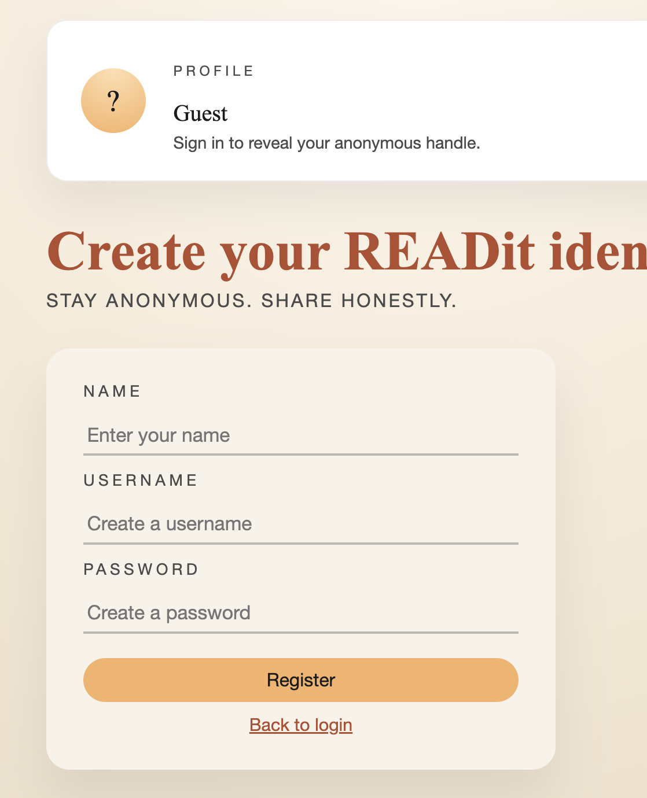
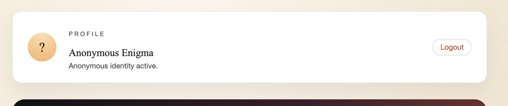
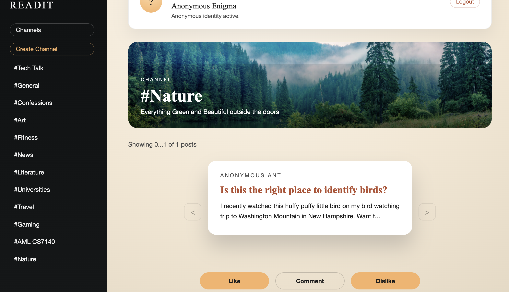
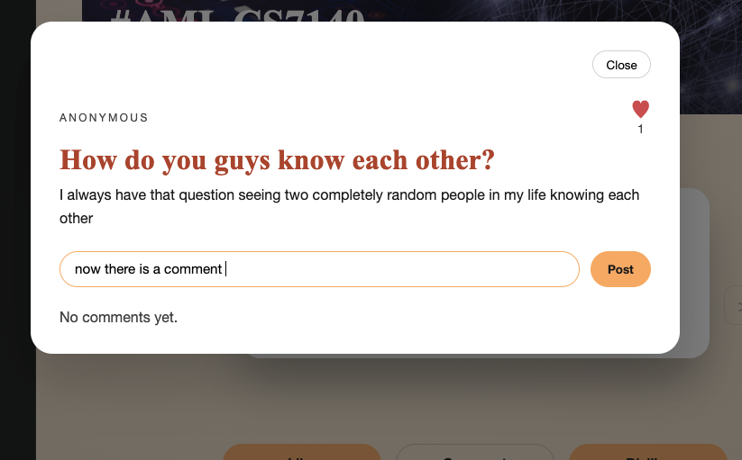
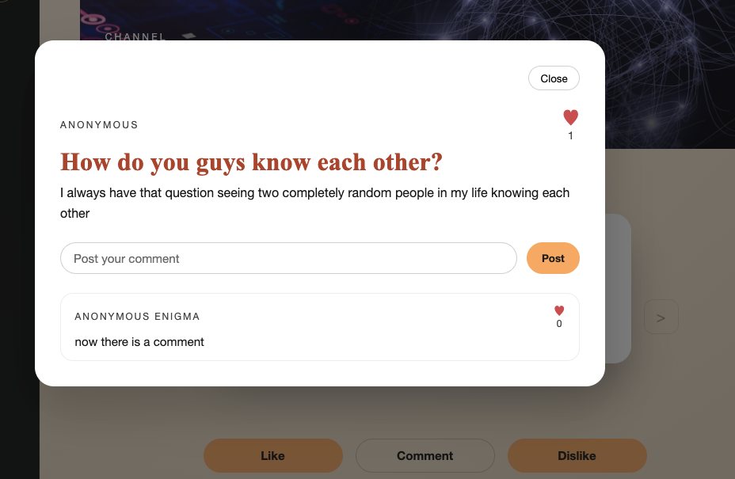
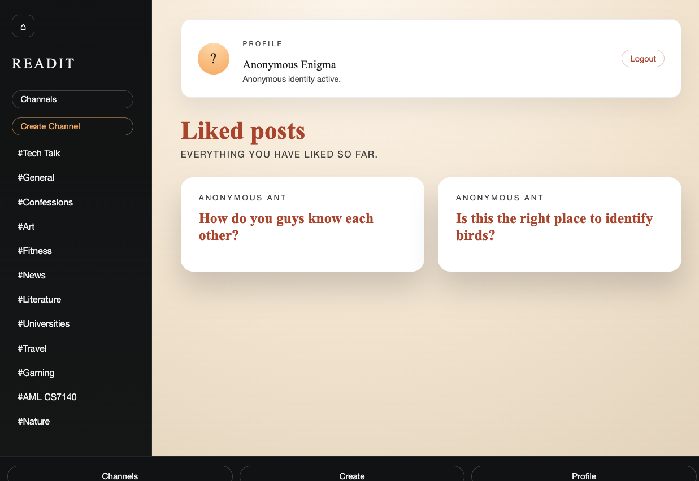
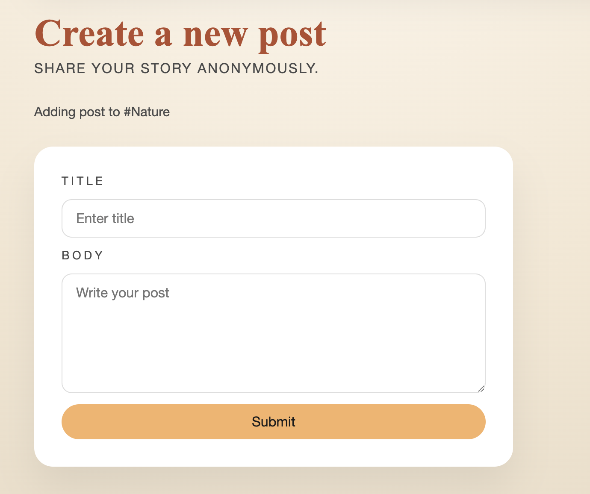

# Project :READit: ANON discussion platform

## Author

Kunj Joshi & Nina Jordan

## Class

CS 5600 – Web Design - Northeastern University
https://johnguerra.co/classes/webDevelopment_online_spring_2026/

---

## Project Objective

READit is a full-stack web application designed to allow anonymous, community discussion through channel grouped or random content. The platform enables users to discover, post, and contribute to conversations in an intuitive and immersive way.

At the core of READit is a swipe-based interaction model: users browse posts by swiping left to skip or right to life. Any user can contribute to posts through commenting sharing their options and saving the post to their profile to revisit

The application is built with a React front end leveraging modern hooks and component-based architecture, paired with a scalable Node.js and Express backend. MongoDB Atlas is used for flexible, cloud-based data persistence.

## Features

Channel-Based Content Discovery:

- With in channels grouped by topic , Create and browses posts to explore content.
- Navigate between homepage, profile page were your likes are visable and content channels

User interaction:

- Hit "dislike" button to skip a post
- Hit "like" to save a post to your profile for later viewing
- Comment on posts to participate in ongoing discussions, click on post to view yours and other comments
- create a post under a certian channel topic

Architecture:

- Modal-based post viewing and commenting
- Immediate UI feedback for actions like likes and interactions
- React using hooks (useState, useEffect, custom hooks)
- RESTful API built with Node.js and Express
- controller, route, and service
- MongoDB Atlas for data
- collections for users, posts, channels, comments, and likes
- API-driven communication between front end and backend using asynchronous requests

---

## Instructions to use and enjoy Boston-Xplorers as a user and screenshots

### Register & login

The first page you will see is the login or register page, if it is your first time please register with name, username and password. Then on returning visits you can remember your username and password to login.

Then you will be on our annonomyus posts page you can start swiping or go to channels button located underneath READIT on the black side bar to view all channels. Select/click the channel that most intreests you. once on this channel posts will appear you can read choose to like, dislike or comment. Like by pressing orange like button this will save this post to your profile.

### Comments

Comment on a post by clicking the comment button write your comment and click "post". now your comment appears under posts, you can also view your profile under liked posts and find your comment there.

### Create posts/channels

You can create your own posts by first selecting channel, clicking the footer button create, it make a form where you can add a title and body of your posts

You can also create new channels using the blackside bar button "create channel"

So please create channels, posts and comments the READit community is ready to hear your thoughts and opintions

---

## Instructions to Build and Run Boston-Xplorers Locally

1. Install project dependencies:
   cd client
   npm install
   cd ../server
   npm install

2. Start the backend server:
   cd server
   npm run dev
   server runs on http://localhost:3000

3. Start frontend Vite in a new terminal
   cd client
   npm run dev
   Client runs on: http://localhost:5173

4. Open the application in your browser
   http://localhost:5173

5. enviortment set up
   VITE_API_URL=http://localhost:3000
   .env file needs to be in client folder

---

## Design Document

The full design document (project description, user personas, user stories, and mockups) is available from:

📄 [View Design Document (PDF)](docs/design-document.md)

---

## Licence

This project is licensed under the MIT License.

See LICENSE file for details.

## Use of Generative AI Tools

This project makes limited and transparent use of generative AI tools to support development and content creation as required by rubric for AI page.

### Tools Used

- **Model:** Claude (Sonnet 4.6)
- **Access Method:** Web interface
- **Model:** ChatGPT (OpenAi)
- **Access Method:** Web interface

### How AI Was Used

AI tools were used for the following purposes: ChatGPT

- Debugging frontend–backend integration issues (API routes, environment variables).

AI tools were used for the following purposes/prompts: Claude
Only used for the Wireframe generation
[12:55 PM]I want you to create images for a website I am planning to design. It is an anonymous social media platform.

To start with the homepage:

Divide the homepage into 2 columns. First column is a Hamburger icon that pops open a side panel. The sidepanel consists of Channels and lists down each of the Channels. Each channel is clickable. The right column is a wider column and divided into 4 rows.

First row is text row which reads: READit in first line and Browse. Post. Comment. Anonymously on the second line.

The second row is posts row. Each post appears as a card and cards are presented as a stack. Each card can be swiped left or right meaning dislike or like respectively. Each card contains a preview text. Each card is clickable as well.

Third row is buttons row. There are three buttons a big red circular cross button that dislikes the current post, a big blue circular comments button that opens the post and its comments and finally a big green tick mark button that likes the post

## The final row is footer. The footer has three buttons each designed using a logo/fa-icon. The first one is Channels,

Lets create the pop-out Post view.

The background remains as the home page, but the post opens up as modal. The post title and content become completely visible in the first square box. The name of poster (bold) and timestamp (smaller font, lighter) appear in the bottom right corner of the post.

The second square box is disconnected from first one and has comments. Each comment is separated by a horizontal line 
(?). Each comment in itself is divided into two rows.
First row is name of the commenter (bold) and the timestamp of comment (smaller font, lighter) . The second row is the comment itself.

---

Now lets create the Channels page.

The Channels page has same side panel as the Homepage
But the right column contains Channels. Each of the channels are shown as cards in Nx2 layout grid where each row contains 2 channel cards.

The channel card itself is divided into 4 rows. The first row contains the channel banner image. The second row contains Channel name which is presented with a # such

All generated content was reviewed, edited, and integrated manually.
