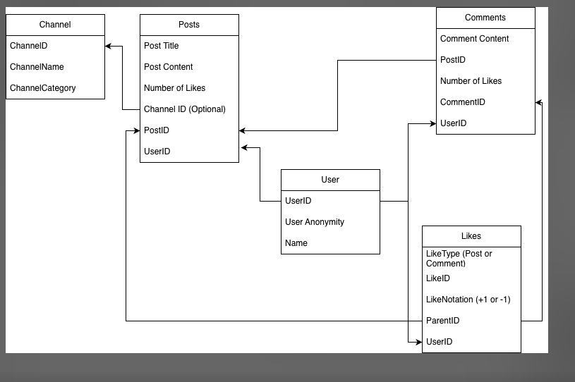
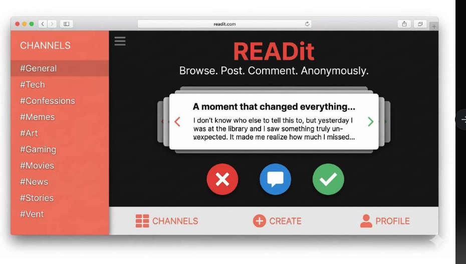
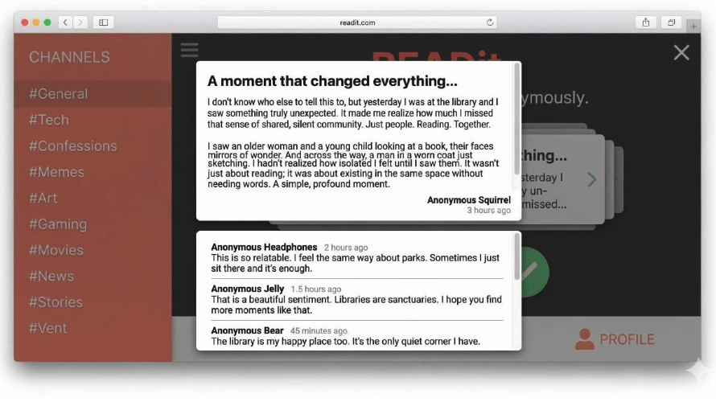

# Design Document – Project 3 - READit

## Project Description

READit is a social media platform for people who like to voice their opinions on a topic and hear about other people's opinions on the topic as well. READit aims at being a healthy conversation place where people can discuss their opinions and send likes or dislikes to opinions they agree/disagree on. Posts and comments would be anonymous. Similar posts are accumulated under a channel and the posts liked by a user appear under their personal channel.

---

## User Personas

### Persona 1 – The poster

**Name:** James

**Wants**
Someone who likes discussing topics online and would like to post his opinions and see how many people agree/disagree with him.

---

### Persona 2 – The Commenter

**Name:** Kevin

**Wants:**
Someone who likes reading through other people's opinions and would like to validate people with matching thoughts or criticize wrongful or hateful opinions.

---

### Persona 3 – The collector

**Name:** Pauline

**Wants:**
a person who likes reading through different posts and collect posts she likes into her homepage feed.

### Persona 4– The deep Diver

**Name:** Luna

Someone who likes discussing her opinions with other people by commenting on their posts or inciting deeper conversations.

---

## User Stories

### Story 1 – curator and collector

As a user, I want to browse my liked posts and channels from the home channel.
As a user, I want to view a list of available channels organized by interests.
As a user, I want to create a new channel for my specific interests.
As a user, I want to click on a channel and view the posts inside it.

---

### Story 2 – create and share opinions

As a user, I want to create a post inside a selected channel.
As a user, I want to browse posts within a channel and like/dislike those posts based on my personal opinions.
As a user, I want to open a post and read its full thread.
As a user, I want to comment on a post to join the discussion.
As a user, I want to view comments under a post in a forum-style format.

---

## Design Mockups

### ERD

### Wireframe design planning

